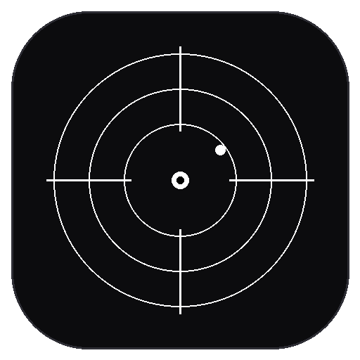
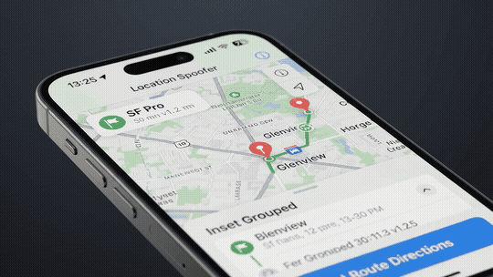

# LSpoof+

<p align="center">
  
</p>

<h3 align="center">Tweak iOS Location Spoofer</h3>

<p align="center">
  GPS location spoofer for sideloaded iOS apps. Supports Life360. <strong>Dylib Tweak File</strong>
<a href="https://www.virustotal.com/gui/file/e7706c93c59bd5059d95ccb3e498b8dc7a1e8c5807790dd9d1b9032a3f250e7e/detection">VirusTotal Analysis</a>
</p>

<p align="center">
  <a href="https://getsentrix.github.io/LSpoof-Plus/"></a>
  <a href="https://github.com/getsentrix/LSpoof-Plus/releases/latest"></a>
  <a href="https://github.com/getsentrix/LSpoof-Plus/blob/main/LICENSE"></a>
</p>

<p align="center">
  
</p>

---

## What's New in v1.2.7

- **Neumorphic UI**
- **Ad-Hoc Code Signing**: Pre-signed arm64 dylib with 16kb segment alignment for LiveContainer, TrollStore, and Sideloadly compatibility.
- **3-Finger Hold Gesture**: Hold three fingers anywhere on screen for 0.8s to open the menu.

---

## What's New in v1.2.6

- **Neumorphic Soft UI Initial Design**
- **Debossed Wells**

## What's New in v1.2.5

- **Fixed Search Nearby & Category Completions**: Selecting "Search Nearby" or category-based Apple Maps auto-suggestions now completes coordinates accurately
- **Fluid Spring & Flow Animations**: Waypoint search and buttons, smooth fade and slide anims, camera focus
- **Unfolding Waypoint Search**: Tap either Start Point or Destination to show native search box
- **Auto-Routing on Selection**: Choosing a suggestion or entering coordinates moves the pin, hides the search box, and looks for driving/walking/cycling directions automatically
- **Ad-Hoc Code Signing**: Pre-signed arm64 dylib with 16kb for LiveContainer, TrollStore, and Sideloadly compatibility
- **3-Finger Hold Gesture**: Hold three fingers anywhere on screen for 0.8s to open the menu
- **Drift Radius Visualization**: Live dashed purple circle overlay shows your randomized GPS fluctuation area directly on the map
- **System Theme Sync**: 3-way theme selector (System, Light, Dark) matches your iOS appearance
- **Route Start Snapping**: 1-tap reticle button anchors route start to your current GPS or spoof location

---

## How to Install

Inject `LocationSpoofer.dylib` into your decrypted app using LiveContainer, Sideloadly, or TrollStore:

### LiveContainer (Recommended)
1. Download `LocationSpoofer.dylib` from [Releases](https://github.com/getsentrix/LSpoof-Plus/releases/latest).
2. Make a folder in the **Tweaks** page and put `LocationSpoofer.dylib` inside of it.
3. Set the tweak folder in the decrypted app's settings to the .dylib folder and run the app.

### Sideloadly
1. Drag your target `.ipa` into Sideloadly.
2. In **Advanced Options** → **Inject Dylibs / Frameworks**, add `LocationSpoofer.dylib`.
3. Click **Start**.

### TrollStore / Azule
```bash
azule -i App.ipa -o SpoofedApp.ipa -f LocationSpoofer.dylib
```
Install the output `.ipa` in TrollStore.

---

## How to Open the Menu

1. Launch your sideloaded app.
2. **Press and hold 3 fingers anywhere on the screen for 0.8 seconds.**
3. Choose your location and tap **Save Settings**.

---

## 🛠️ Features

- **Map & Search**: Search addresses, cities, and landmarks with Apple Maps. Tap or drag the pin anywhere.
- **Coordinates**: Enter exact Latitude, Longitude, and Altitude with sign toggle (`+/-`).
- **Bearing & Direction**: Compass heading slider (0°–359°) with direction feedback.
- **GPS Drift**: Natural fluctuation slider (5m–150m) with live visual circle overlay.
- **Route Simulation**: Set start and end points along real roads. Walk (5 km/h), Cycle (15 km/h), Drive (50 km/h), or Custom speed.
- **Bookmarks & Recents**: Save favorites with custom names and quick-apply your last 5 locations.
- **Auto-Update Alerts**: Alerts you when an update is available on GitHub with a 1-tap download prompt.

---

## 🔨 Build from Source

```bash
export THEOS=/path/to/theos
make clean
make
```

Output: `.theos/obj/debug/LocationSpoofer.dylib` (arm64 iOS 14.0+)

---

## 📄 License

MIT License. Maintained by [getsentrix](https://github.com/getsentrix).
